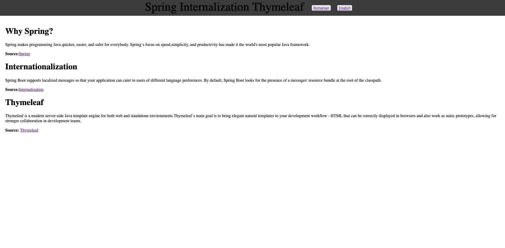
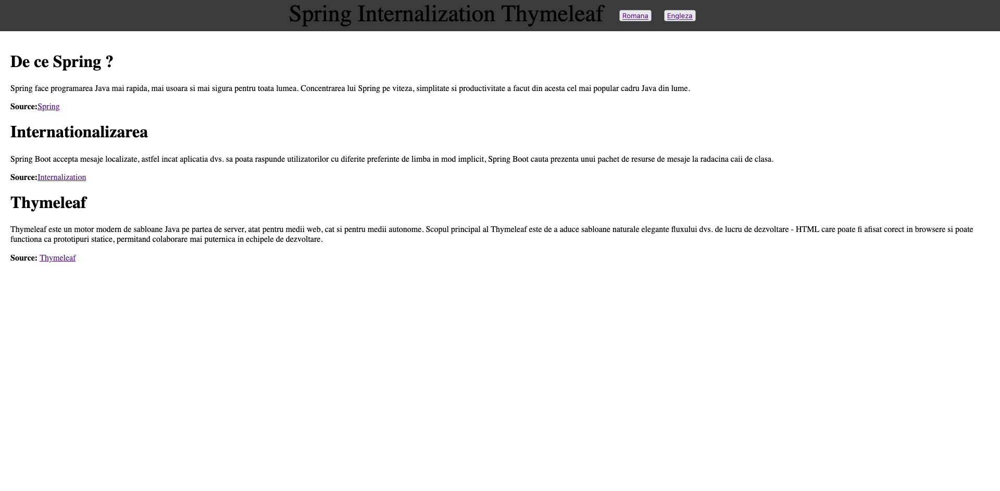

# Spring Internalization Thymeleaf

## Structure:

### Back-end

* Configurator (Internalization) where we set all settings for internalization.
* Controller (MainController) where we create the mapping for our front-end page (index.html).

### Front-end

Host: localhost:8080/index  
Resources:

* Languages => resource bundle from the app who take information to facility the entire internalization.
* Templates (index.htm) our web page.

Internalization =>

* English
  

* Romanian
  
